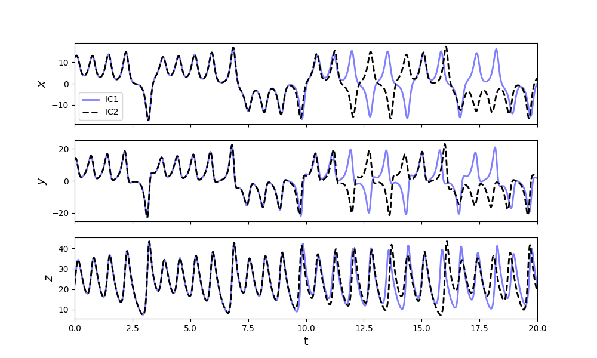
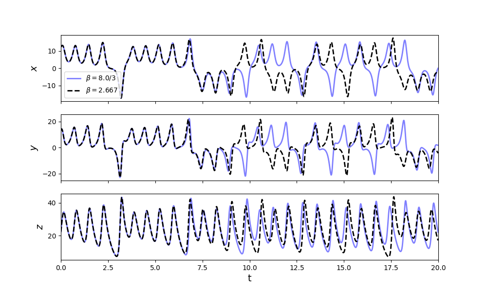

# SystemIdentification

Python and Octave scripts for the identification of linear and nonlinear dynamical systems using standard regression, SINDy and other methods.

We know about the sensitivity of chaotic dynamical systems to the initial conditions, popularly known as `the butterfly effect`. But, it is the sensitivity of these systems to the values of the coefficients that makes their identification quite challenging. We need methods, tools and programming language that use and allow for higher accuracies and precision if we aim to make progress in the right direction.

## Lorenz system - sensitity to the initial conditions

## Lorenz system - sensitivity to the coefficients

